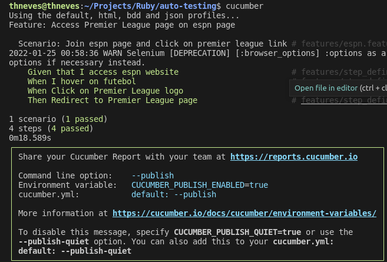

# Testing with Cucumber

Little project to get started with Cucumber testing framework and BDD.

The projects tests the access to the [Premier League](https://www.espn.com.br/futebol/liga/_/nome/eng.1/premier-league) page on [Espn](https://espn.com.br/) website

## Requirements

 - Ruby
 - Bundle
 - Chrome Driver

 Installing chrome driver:

 - `wget https://chromedriver.storage.googleapis.com/76.0.3809.126/chromedriver_linux64.zipunzip`
 - `chromedriver_linux64.zipsudo mv chromedriver`
 - `/usr/bin/chromedriversudo chown root:root`
 - ` /usr/bin/chromedriversudo chmod +x /usr/bin/chromedriver`

## Gems

- Cucumber
- Capybara
- Selenium
- Chrome Driver
- Report Builder

## Running the tests

Clone this repo, run `bundle`, and then run `cucumber` on your terminal.

Check the results and the generated report html files and screenshots.

